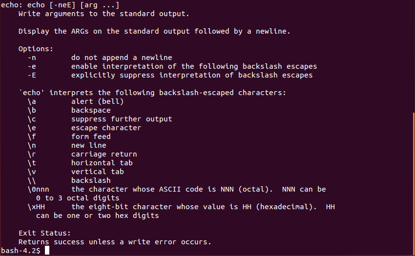
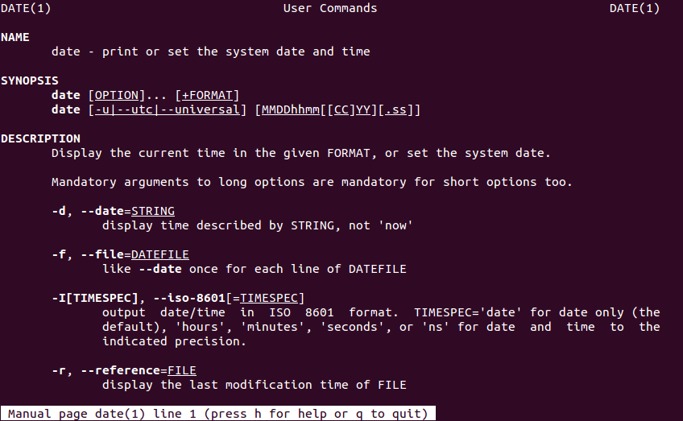

# Lecture 2: Commands and variables

**Last update**: 20220425

### Table of Contents
1. [Introduction](#introduction)
2. [Shell environment](#environment)  
     A) [Commands](#commands)  
     B) [Variables](#variables)    
3. [Editing a file in the terminal](#editing_file)
4. [Your first **Bash** script](#first-script)
5. [Special configuration files in **Bash**](#configuration-files)


### 1. Introduction <a name="introduction"></a>

When it comes to the operating systems nowadays, in high-energy experimental physics we mostly rely on **Linux**. That being said, as an experimental physicist you are sooner or later faced with the following situation: You have turned on your computer and launched the terminal...


... and what now?? 

You can start clicking with the mouse over the terminal, but quickly you will realize that this leads you nowhere. Next, you can start typing and pressing 'Enter', but especially if you do it for the first time most likely whatever you have typed in the terminal will produce only the error messages. Still, that is something, as it clearly means that there is some secret/magic command interpreter which is trying to respond to your command input, as soon as you have typed something in the terminal and pressed 'Enter'. 

What is that secret built-in command interpreter available in the terminal? This lecture is all about shedding light on its existence...

Loosely speaking, **shell** is the generic name of any program that user employs to type commands in the terminal (a.k.a. text window).  Example **shells**:

* sh 
* bash
* zsh
* ksh
* csh
* fish
* PowerShell (developed by Microsoft!)

To get the list of **shells** available on your computer, type in the terminal:

```linux
cat /etc/shells 
```

The output of that command could look like:

```bash
/etc/shells: valid login shells
/bin/sh
/bin/dash
/bin/bash
/bin/rbash
/usr/bin/screen
/usr/bin/fish
```

How to select your favorite **shell**? It is simple, just type its name in the terminal and press 'Enter'! E.g. if you want to use **Bash** as your working **shell**, just type in the terminal:

```linux
bash
```
and press 'Enter' --- now you are in the **Bash** wonderland! Since that is by far the most popular **shell** nowadays, this lecture will focus exclusively on its concepts, syntax and commands. But no worries, at least conceptually, a lot of subjects covered in this lecture apply also to other **shells**! The difference between **shells** is mostly in the syntax, but in essence, they all aim to provide the same functionalities.

In this lecture we will cover only the **Bash** essentials, i.e. we will make you going, but how far you want to go eventually, it depends on your personal determination and time investment.

Important remark: **Bash** (or any other **shell** as a matter of fact) is first and foremost a command interpreter (i.e. interface for executing commands). Even though it offers a lot of functionalities typical for programming languages, its direct use as a programming language is only a distant second goal. In practice, within **Bash** code we can use directly and easily executable of any full-fledged programming language (e.g. **C**, **C++**, **Mathematica**, etc.). But none of these languages can be used directly and easily as a command interpreter in the terminal.

Traditionally, the first program people write when learning a new programming language is the so-called _"Hello World"_ example. Let's keep up with this tradition and type in the terminal:

```bash
echo "Hello World" 
```

This will output in the terminal:

```bash
Hello World
```

i.e. **Bash** has echoed back the text "Hello World" typed in the terminal as an _argument_ to **echo** command. Let's move on!


### 2. Shell environment: commands and variables <a name="environment"></a>

When you open a terminal, your local environment is defined via some command names and predefined variables, which can be used directly in the current terminal session. Before going more into the details of how to modify the **shell** environment, let us see first how commands and variables are used in general.

#### A) Commands <a name="commands"></a>

We have already seen how one built-in **Bash** command works, namely **echo**. In the same spirit, we can use in the terminal any other **Linux** command, not necessarily the built-in **Bash** command.

**Example:** What is the current time? Just type in the terminal **date** command and press 'Enter'

```linux
date
```

This will output in the terminal something like:
```bash
Mon Apr 20 14:49:10 CEST 2020
```

This is the default formatting of **date** command. Now use the command **date** with the flag (or option) **-u**, in order to modify its default behavior:

```linux
date -u
```

This will output in the terminal the different text stream:
```bash
Mon Apr 20 12:49:12 UTC 2020
```

After passing a certain flag, we have instructed command **date** to change its default behavior. In the above example, the flag **-u** caused the command **date** to report time in Coordinated Universal Time format (UTC), instead of Central European Summer Time (CEST) time zone (which is the default for our location). 

As another example, we have already seen how we can use **cat** command to view the content of file when inquiring which **shells** are available on the computer. We can pass to command **cat** as arguments more files to read in one go, i.e. we can execute the same command in one go on multiple arguments:

```linux
cat /etc/shells /etc/hostname
```

The output of that command now could look like:

```bash
/etc/shells: valid login shells
/bin/sh
/bin/dash
/bin/bash
/bin/rbash
/usr/bin/screen
/usr/bin/fish
transfer.ktas.ph.tum.de
```

Note the new entry in the last line, which is the content of file ```/etc/hostname``` . 

We can, of course, combine options and arguments when invoking a command: 

```linux
cat -n /etc/shells 
     1	# /etc/shells: valid login shells
     2	/bin/sh
     3	/bin/dash
     4	/bin/bash
     5	/bin/rbash
     6	/usr/bin/screen
     7	/usr/bin/fish
```

The flag **-n** causes command **cat** to enumerate all lines in its printout.

In general, all **Bash** and **Linux** commands are conceptually implemented in the same way --- let us now discuss what is conceptually always the same in their implementation and usage. 

Generically, for most cases of interest, we are executing commands in the terminal in the following way:

```linux
<command-name> <option(s)> <argument(s)>
```

This is the right moment to stress the importance and profound meaning of empty character: Empty character is the default input field separator (**IFS**) in the world of **Linux**. If you misuse the empty character, a lot of input in the terminal will be completely incomprehensible to **Bash**, and to **Linux** commands in general.  In the above generic example, empty character separates the three items, which conceptually have a completely different meaning. As the very first step, after you have typed the input in the terminal and pressed 'Enter', the **Bash** splits your input into tokens that are separated (by default, and in a bit simplified picture) with one or more empty characters. Then, it checks whether the very first token is some known **Linux** command, **Bash** keyword, etc.

The command input in **Bash** is terminated either by a new line or by a semi-colon ```;``` . It is completely equivalent to write:

```bash
echo "Hello World"
date
```
or 
``````bash
echo "Hello World";date
``````
or 
``````bash
echo "Hello World" ;   date
``````


Let us now scrutinize the above generic syntax for command execution term by term:

* ```<command-name>``` : Whatever you type first in the terminal, i.e. before the next empty character is being encountered on terminal input, **Bash** is trying to interpret as some known **Linux** command, **Bash** keyword, etc. In general, _command-name_ stand for one of the following:

  1) **Linux** command (i.e. system-wide executable or binary) --- example:  **cat**  
  2) **Bash** built-in command --- example: **echo**   
  3) **Bash** keyword  --- example: **for**   
  4) alias   
  5) function   
  6) script   

* ```<option(s)>``` : Options (or flags) are used to modify the default behaviour of command. Options are indicated either with:

	1) **-** (single dash) followed by single character(s), or   
	2) **-\-** (two consecutive dashes) followed by more descriptive explanation about what needs to be modified in the default behaviour of command.

For instance, the frequently used flags **-a** and **-\-all** are synonyms, in a sense that they modify the default behavior of command in exactly the same way. The first version is easier to type, but the second one is easier to memorize. Example for **date** command:

```linux
date -u
Mon Apr 20 12:49:12 UTC 2020
date --utc
Mon Apr 20 12:49:12 UTC 2020
```

The output in both cases above is the same, because flags **-u** and **--utc** are synonyms when used for **date** command.

But how do we know that for command **date** flags **-u** and **-\-utc** are available, and how do we know in which way they will modify the default behavior of command? All such options for each command are documented in so-called _man pages_. Whenever you develop a new command, it is also essential that you develop its documentation, otherwise nobody will be able to use your command. For built-in **Bash** commands, documentation is retrieved simply with:

```bash
help <command-name>
```

For **Linux** commands, we can use the command **man** (shortcut for _manual_) to retrieve the documentation. The syntax is fairly simple:  

```linux
man <command-name>
```

**Example:** To see which options are available for built-in **Bash** command **echo**, use:

```bash
help echo
```
The printout on the screen could look something like:



The command **help** gives a complete description of the built-in **Bash** command (e.g. **echo**, **jobs**, **read**, etc.) or of some **Bash** keyword (e.g. **for**, **if**, etc.). 

**Example:** To see which options are available for **Linux** command **date**, use:

```linux
man date
```

The first page of a rather lengthy output could look like:



In order to exit the _man pages_, press 'q'. You can scroll down the _man page_ line-by-line by pressing 'Enter', or page-by-page by pressing 'Spacebar'. 

As you can see, even simple commands, like **date**, can have extensive documentation and a lot of options. It is clearly impossible to memorize all options for all commands, therefore usage of **help** and **man** commands is needed almost on a daily basis. After we have covered command names and options, we close this section with the last item: command arguments.

* ```<argument(s)>``` : This is simple, sometimes you want your command to be executed on the specified argument, or in one go on multiple arguments. For instance, we can make an empty file in the current working directory by using the **touch** command:

```linux
touch file_1.log
```

But we could create plenty of empty files with **touch** command in one go, not one-by-one, e.g.

```linux
touch file_1.log file_2.log file_3.log file_4.log
```

Important remark: Since the empty character is an input field separator, never use it as a part of a file or directory name! In such a context, always replace it with underscore "_" or any other character which does not have special meaning. For instance:

```linux
touch file 1.log
```
would literally create two empty files, the first one named ```file```, and the second one named ```1.log``` . If you apply **touch** command on an already existing file, only the time-stamp of that file will be updated to the current time, its content remains exactly the same. 

In order to see or list all files and subdirectories in the current working directory, use **ls** command, i.e. 

```linux
ls -al
```
For the meaning of options **-a** and **-l** check the _man pages_ of **ls** command. As a side remark, we indicate that options may or may not themselves require specific arguments. Options which do not require specific arguments, can be grouped together, i.e. **ls -a -l** is exactly the same as a shorthand **ls -al**. 

In the same spirit, we can create multiple directories in one go, with **mkdir** command, e.g. 

```linux
mkdir subdir_1 subdir_2 subdir_3
```
will make 3 new subdirectories in your current working directory (check again by executing **ls -al**).

We have been using so far only the already existing **Bash** or **Linux** commands. The simplest way to create your own command, with a rather limited functionality and flexibility but nevertheless quite convenient, is to use **Bash** built-in feature **alias**. If you are bored to type something lengthy again and again in the terminal, you can introduce shortcut for it, by using **alias**. For instance, you can abbreviate this lengthy input

```bash
echo "Hello, welcome to the lecture PH8124"
```
into the simple new command **Welcome** by creating an alias for it:

```
alias Welcome='echo "Hello, welcome to the lecture PH8124"'
```
Now the following new command in the terminal works as well:

```bash
Welcome
```
Press 'Enter' and the output in the terminal shall be:
```bash
Hello, welcome to the lecture PH8124
```
Quite frequently, aliases are used in the following context:  If you want to connect from your desktop machine to some other computer, e.g.  _lxplus_ at CERN, you need to type in the terminal something like:

```linux
ssh -Y abilandz@lxplus.cern.ch
```

But do you really want to type that again and again each time you want to connect to _lxplus_ at CERN? You can save a lot of typing, by introducing the alias for it:

```bash
alias lx='ssh -Y abilandz@lxplus.cern.ch'
```
Here basically you have defined the abbreviation (or alias, or shortcut) for lengthy command input, and you have named it **lx**. Now it suffices only to type in the terminal 

```bash
lx
```
and you will be connecting to _lxplus_ at CERN with much less effort and time investment. 

Another typical use case of aliases is to prevent command name typos. For instance, if you realize that too frequently instead of **ls** you have a typo **sl** when writing in the terminal, which does nothing except producing an error message, you can simply define the new alias for it:
```bash
alias sl=ls
```
After this definition, **sl** is literally a synonym for **ls** command.

If you have forgotten all aliases you have introduced in the current terminal session, just type in the terminal

```bash
alias
```
and all alias definitions will show up. If you want to see what is the definition of the concrete alias you have introduced, use 

```bash
alias <alias-name>
```
The alias definition can be removed with **Bash** built-in command **unalias**, e.g.:

```bash
unalias <alias-name> 
```

If you want to clean up all aliases in the current terminal, use:

```bash
unalias -a
```

where also for this command the option **-a** stands for 'all'. 

Aliases are definitely a nice feature, but do not overuse them, because:

* By default, aliases are available only in the terminal in which you have defined them. But this can be easily circumvented by modifying the special configuration files ```.bashrc``` and/or ```.bash_aliases``` --- to be clarified later in this section;

* When you move to another computer your personal aliases are clearly not available there by default;

* Aliases can overwrite the name of the existing **Linux** or **Bash** command --- aliases will have the higher precedence in execution. In this case, you can execute the overwritten command with ```\commandName```. For instance:

  ```bash
  alias ls="echo 44"
  ls
  44
  \ls
  ... list of files and directories ...
  ```

  In this context, we have _escaped_ the alias definition of 'ls' with the special symbol backslash ```\``` --- this mechanism is elaborated more in detail and in a wider context later;   

* Aliases cannot process programatically options or arguments, like regular commands (or **Bash** functions, as we will see later). In fact, any alias implementation can be reimplemented as a **Bash** function in a more general and flexible way, however the latter requires more coding.

Aliases are literally shortcuts for lengthy commands or any other lengthy terminal input. They are defined for convenience only to save typing. Whatever you have defined an alias to stand for, **Bash** with simply inline or replace the alias name in the terminal with its definition, and then execute --- nothing more nor less than that! 


#### B) Variables <a name="variables"></a>

Just as any other programming language, **Bash** also supports a notion of _variable_. How to define variable in **Bash**? For instance, we want to use the variable named ```Var``` and initialize it with the value of 44. Simply type in the terminal: 

```bash
Var=44
```
While this appears to be the most trivial thing you could do, even at this simple level we can encounter some problems, which can very nicely illustrate some of the general design philosophy used in **Bash** and **Linux**. Most importantly, since an _empty character_ is the default input field separator, it would be completely wrong to type any of the following:

```bash
Var =44 # WRONG!!
Var= 44 # WRONG!!
Var = 44 # WRONG!!
```
In the 1st and 3rd cases above, we get an error message, e.g. ```Var: command not found```, since **Bash** was trying to interpret the first token in the input, ```Var``` in this case, as a command name. Since command named ```Var``` was not found, **Bash** writes the error message in the terminal. 

In the 2nd case, the error message is slightly different, namely ```44: command not found```, and it requires a separate explanation. In general, if we define a variable and execute some command in the same line like in the 2nd case above, without using ```;``` to separate them, the content of that variable is visible only during the execution of that particular command. The generic syntax is:

```bash
Var=value command # content of 'Var' is seen only in 'command' during its execution
```

That means that ```Var= 44``` **Bash** will interpret as follows: Set the content of ```Var``` to nothing (i.e. remove the previous content if it existed), and use that new content only during the execution of command named '44'. Since such command does not exist, we get the error message ```44: command not found``` for this particular case. 

Therefore, when introducing and initializing a new variable in **Bash**, make sure there are no empty characters on both sides of the _assignment operator_ **=** .

As a side remark, from the above three lines, we can also see how to make a comment in **Bash** --- simply use the special character **#** (hash symbol) to start your comment. Once this character is used on the particular line, any text after it is being ignored by **Bash**. You can not terminate the comment within a given line in which you have used **#** to start the comment. Therefore, you can terminate the commented text only by starting to write in the new line.

**Example:** Writing a comment in **Bash** .

```bash
echo "Hi there" # this is some comment which Bash ignores
Hi there
```

Once defined, how to use (or reference) the content stored in a variable? In order to reference the content of a variable, we use the special symbol **$** to achieve that, e.g. 

```bash
Var=44
echo $Var
```

Also this syntax will do the job:

```bash
Var=44
echo ${Var}
```

In both cases the printout in the terminal is the same, namely:

```bash
44
```

So what is the difference between the two syntaxes above? The latter is less error-prone (as it clearly delineates with curly braces the variable name from the rest of the code!) and more powerful, as it enables a lot of built-in functionalities for the string manipulations programmatically within **Bash**. 

As an example, this will produce the desired result only in the latter case: 

```bash
Var=44
echo test${Var}test
```
The output is:
```bash
test44test
```
If the first and shorter syntax is used instead, then ```Vartest``` would be interpreted as a variable name, and since such variable was not defined, it would evaluate to the null string. 

```bash
Var=44
echo test$Vartest
```
The output is:
```bash
test
```

Few final additional remarks on variables in **Bash**:

* They are untyped (i.e. you do not need to specify at declaration whether variables are integers, strings, etc.). By default, all **Bash** variables are strings, but if they contain only digits and if you pass them to some operator which takes as argument(s) only integers, then **Bash** will interpret the variable as an integer;
* By convention, for the names of built-in **Bash** variables only capital characters are used (e.g. **BASHPID**, **BASH_SOURCE**, etc.), while for command names we use all low-case characters. For user's variables, use some intermediate case, like ```Var``` or ```someVariable```, to ease the code readability and to avoid potential conflict with the existing built-in **Bash** variables. Variable name starts with a letter or underscore, and may contain any number of following letters, digits and underscores. Variable name can not start with a digit;
* The lifetime of a variable is by default limited to the terminal session in which you have defined it. But you can make its existence persistent in any new terminal you open (i.e. in your _environment_) by adding its definition to the very special ```.bashrc``` configuration file (more on this at the end of this section!);
* It is possible to store in the variable the output of some command, and then manipulate this output programmatically (more on this later!);
* It is possible to store in the variable the content of an external file (more on this later!);
* There are some built-in variables always set to some values, e.g. **HOME**, **SHELL**, **PATH**, etc. These special variables are the essential part of your **shell** environment, and if they are not set correctly, everything in your current terminal session can start falling apart (more on this later!).

Now that we have covered the very basics of commands and variables, let us see how we can develop the first **Bash** scripts. In order to achieve that, the very first step is to learn how to edit the file in the terminal. 


### 3. Editing a file in the terminal <a name="editing_file"></a>

We have already seen how with **touch** command we can make an empty file. Now we will see how we can write a file or edit an already existing file in the terminal. The simplest way to write a new file, solely in the terminal (i.e. without using any graphics-based editor like **gedit**, **emacs**, **vim**, etc.), is to use the command **cat**, in the following construct:

```linux
cat > someFile.txt
 This text is the content 
  of my 
first 
   file.
CTRL+d
```
In the above construct, command **cat** takes the input directly from the standard input (keyboard by default), and redirects everything via operator ```>``` into the physical file named ```someFile.txt``` in your current working directory. You terminate the input, i.e. you mark the end of the file, by first moving to the new line with pressing 'Enter', and then finally by pressing ```CTRL+d``` on an empty line (if you press ```CTRL+d``` when the line is not empty, the input to the file is not terminated!). Now you can see the content of your newly created file with:

```linux
cat someFile.txt
```
Note that **cat** preserves all empty characters, line breaks, etc. In the case you want to append something to the already existing file, we can use a slightly modified construct:

```linux
cat >> someFile.txt
test 1
test 2
CTRL+d
```
The operator ```>>``` appends the text at the end of an already existing file. If we would have used ```>``` to redirect the new content to the already existing file, that file would be overwritten with this new content --- use ```>``` in such a context with great care! This, however, also implies that the above **cat** construct is rather limited, as it can be used either to write a new file from scratch or to append new content at the very end of an already existing file. But what if we want to edit the already existing content of the file? 

For that sake, we need to use some simple editor which can be run in the terminal (i.e. without graphics). One such, wide-spread, open-source, editor is **nano**, which includes only the bare minimum of functionality needed to edit documents, making it very simple to use. In addition,  syntax coloring is available for most of the programming languages. Now as an exercise, let us edit the content of already existing non-empty file ```someFile.txt``` from previous **cat** example.

```linux 
nano someFile.txt
```
Now you are in the **nano** wonderland, not any longer in the **Bash** shell. This means that the commands you type now and all keyboard strokes are interpreted differently. After you have edited some existing text or wrote something new, simply in **nano** press ```CTRL+o``` (to write out into the physical file ```someFile.txt``` what you have edited so far in the editor --- this is the same thing as saving, just jargon is different...). When you are done with editing, press ```CTRL+x``` to exit **nano** (and type 'y' followed by 'Enter' if you want to save the changes in the same file you have started with), and get back to the terminal. Of course, usage of **nano** is not mandatory to edit files, and for large files it is very inconvenient, but there are two nice things about **nano** which shouldn't be underestimated --- it is always available on basically all **Linux** distributions, and it can be run in the terminal (this becomes very relevant when connecting and working remotely on some computer, where access to graphics by default is not enabled, or when the network connection itself is too slow to sustain transmission of graphics!). For the editing of lengthy files, use some graphics-based editor: **gedit** is very easy to use without any prior experience, while **emacs** or **vim** are difficult for beginners, however they offer much more features and are regularly used by professional programmers.


### 4. Your first **Bash** script <a name="first-script"></a>

Now that we know a few basic commands and how to write and edit files, we can start writing our first **Bash** scripts. The script is a code snippet for interpreted or scripting language, that is typically executed line-by-line.  At the very basic level, this saves the effort of retyping that particular sequence of commands each time it is needed. Typically, scripts are used to automate the execution of tasks that could alternatively be executed one-by-one by a human operator. A scripting language is a programming language that supports scripts, so clearly **Bash** fits in this category.

Let us now write the first **Bash** script! For instance, you can type in the terminal:

```linux
nano first.sh
```

Recall that now you are not any longer in the terminal, but in the very simple textual editor called **nano**. Whatever you are typing now, it will be saved in the file ```first.sh``` --- the file which will hold your first **Bash** script (by convention **Bash** scripts always have an extension **.sh**). Your first  **Bash** script could look as follows:

```bash
#!/bin/bash

echo "Welcome to Bash lecture"
# This is a comment...
echo "Today is:" 
date

return 0
```

Now let us have a closer look at the content of your first **Bash** script:

* The first line is mandatory, namely: ```#!/bin/bash```
* The first two characters in the first line are mandatory, namely: ```#!``` (the combination of these two characters is called shebang or hashbang)

What is happening here is the following: ```#!``` in the first line indicates to the operating system that whatever follows next on the first line, must be interpreted as a path to the executable (e.g. ```/bin/bash``` if you want to run **Bash**), which then must be used to interpret the code in all the remaining lines in the script. In this way, you can put up together any script, not necessarily the one for **Bash** --- you just need to change ```/bin/bash``` in the first line, and point out to some other executable.

From the above example, you can see that whatever we have previously executed directly in the terminal (e.g. **echo** or **date** commands), we can also write in the script, and then execute all commands in one go, by executing the script. That being said, at the very basic level, scripting saves you the time needed to retype again and again any regular sequence of commands, after you open a new terminal --- for instance, the file ```first.sh``` you just made, is available in any new terminal you open!

How to execute the **Bash** script? It's simple, just pass the file name as an argument to the command **source** (i.e. in jargon, you need to _source_ your script):

```bash
source first.sh
```

And the output could look like:

```bash
Welcome to Bash lecture
Today is:
Mon Apr 20 16:07:18 CEST 2020
```

Equivalently, you can use the shortcut notation ```.``` (dot):
```bash
. first.sh
```

In this context, **source** and ```.``` are synonyms (compare the output of ```help source``` and ```help .```). 

Finally, ```return 0``` sets the _exit status_ of your script. In general, each command in **Bash** or **Linux** upon execution provides the so-called exit status. This is a fairly general concept, characteristic also for some other programming languages, and it enables us to programmatically check if the command has executed successfully or not. The exit status is classified as:

* 0 : success
* 1, 2, 3, ... , 255 : various error states

The exit status is stored in the special variable **$?**. For instance:

```linux
date
echo $? # prints 0 , i.e. success
```

and

```linux
date -q # option -q is NOT supported
echo $? # prints 1 , i.e. one possible exit status for error
```

Typically in your code, after you have executed the command, you check its exit status. Then, depending on the value of this exit status, your subsequent code can branch in multiple directions. Remember that each **Linux** command has an exit status stored in the special variable **$?** upon its execution, so it shall also your  **Bash** script. As long as you are executing your script via **source** command, you can set the exit status with the keyword **return** (as in the last line in your above script ```first.sh```). 

If you forgot to specify the exit status of your script with the keyword **return **, the special variable **$?** is nevertheless automatically set, but now to the exit status of lastly executed command in your script, which can lead to unexpected results.


### 5. Special configuration files in **Bash** <a name="configuration-files"></a>

In this section, we discuss a few important configuration files which have a special meaning to **Bash**. The configuration files which a user can directly edit, acquire their special meaning only if they are placed in the user's home directory, otherwise **Bash** will not find and execute them. To stress this out, we have prepended ```~``` (or equivalently ```$HOME```) to the name of the user's configuration files below. The special character ```~``` (tilde) is the shortcut for the absolute path to your home directory. As an example, execute:

```bash
echo ~
```

The output might look like:

```bash
/home/abilandz
```

This is the absolute path to your home directory in the **Linux** file system. The slash ```/``` delineates directories in the **Linux** directory structure (on **Windows** backslash ```\``` is used instead in the same context). Each time you login, by default this is your starting working directory. This information is alternatively also stored in environment variable **HOME**, i.e. try:

```bash
echo $HOME
```

By convention, the name of all configuration files in the home directory begins with '.' (dot), which means that **ls** will not list them by default.

#### User's configuration files

These are the personal configuration files in the user's home directory, which can be edited directly:

- ```~/.bash_profile``` : this configuration file is only executed by **Bash** each time you log in on the computer. There are two synonyms for this file:  ```~/.bash_login``` and ```~/.profile``` , and they are executed at login only if ```~/.bash_profile``` is not present in your home directory. The files ```~/.bash_profile``` and ```~/.bash_login``` can be read only by **Bash**, while ```~/.profile``` is read also by some other shells, e.g. **sh** and **ksh**
- ```~/.bashrc``` : this configuration file is read with the highest priority when you open a new terminal, or when you start a new _subshell_ (covered later in the lecture). This file will be read also at login only if you add a line ```source ~/.bashrc``` in ```~/.bash_profile```  

- ```~/.bash_logout```: Executed whenever the shell exits (e.g. when you close the terminal, of when you log out from the computer). This configuration file is rarely used, but by editing this file, you can for instance automatically delete all temporary files at exit

#### System-wide (default) configuration files

If by accident you have deleted your personal configuration files in your home directory, as a backup solution you can always rely on the two system-wide configuration files, which you cannot edit directly without having the administrator privileges:

- ```/etc/profile``` : the default, system-wide, configuration file which is read at login. It is read before ```~/.bash_profile```. This means that you will always have some default settings enabled after you log in on the computer, whether or not ```~/.bash_profile``` with your personal settings exists or not

- ```/etc/bash.bashrc``` : the default, system-wide, configuration file which is read each time you open a new terminal or start a new subshell. It is read before ```~/.bashrc```. This means that you will always have some default settings enabled after you open a new terminal or start a subshell, whether or not ```~/.bashrc``` with your personal settings exists or not  

We now elaborate on the usage of these configurations files by considering a few concrete examples.

We have already seen how to define your own aliases and variables and we already stressed out one important point: Their lifetime is limited to the duration of the terminal sessions in which you have defined them. In any new terminal you start, their definitions are not known. But there is one important thing which happens behind the scene each time you start a new terminal, and before you can start typing anything: **Bash** reads automatically the configuration files end executes line-by-line whatever is being set in them. 

In the most cases of interest, it suffices to know that you need to edit directly your personal file, e.g. ```~/.bash_aliases```, and then in the **Bash** configuration files ```~/.bash_profile``` and ```~/.bashrc```, which must be stored directly in your home directory, you insert the line:

```bash
source ~/.bash_aliases
```

For instance, let us edit in your home directory the file named ``` ~/.bash_aliases``` (any other name is perfectly fine as this is your personal file, not a special configuration file!). We start by executing in the terminal:

```bash
nano ~/.bash_aliases
```

And then in **nano** write the following two lines:

```bash
Var=44
alias sl=ls
```

Save the file and exit **nano** (press ```CTRL+x``` and choose 'y' followed by 'Enter'). You can check the content of file  ```~/.bash_aliases``` via 

```bash
cat ~/.bash_aliases
```

or, if the file got too lengthy and you need to scroll page-by-page, via 
```bash
more ~/.bash_aliases
```

Since the content of ```~/.bashrc``` file is read and executed each time you start a new terminal, and before you can start typing anything in the terminal, your own personal definitions (e.g. for aliases and variables) will be re-defined from scratch each time you start a new terminal, and you can re-use them again and again. 

Now add the following line at the very end of ```~/.bashrc``` (if this line is already not inside that file --- by default it is already inside on most **Linux** distributions):

```bash
source ~/.bash_aliases
```

Each time you run a new terminal, the variable ```Var``` is set to 44, and you can use **sl** as the synonym for the **ls** command, i.e. you do not need to define them again in the new terminal sessions. In the case you need to add more aliases, simply edit again the file ```~/.bash_aliases``` .

We remark that it is much safer to edit directly ```~/.bash_aliases``` than to edit directly the file ```~/.bashrc```, where also some other and more important settings can be defined as well. In the case you move to another computer, you can enable your aliases there simply by porting the file ```~/.bash_aliases``` , and adding on the new computer in ```~/.bashrc``` and ```~/.bash_profile``` the line ```source ~/.bash_aliases```. On the other hand, typically it's very difficult to port the whole ```~/.bashrc``` from one computer to another, especially if they are running different **Linux** distributions.

Finally, we can also edit the ```~/.bash_logout``` in the following example way:

```bash
# Set what will be executed when shell exits (e.g. when you close the terminal):
echo "Hasta la vista, that was all for today."; sleep 1s
```

Now each time you close the terminal, you will see the specified printout, and after the hardwired timeout of 1s, the terminal will close. In the very same spirit, you can specify any other action, which will be automatically executed by **Bash** when you close the terminal.