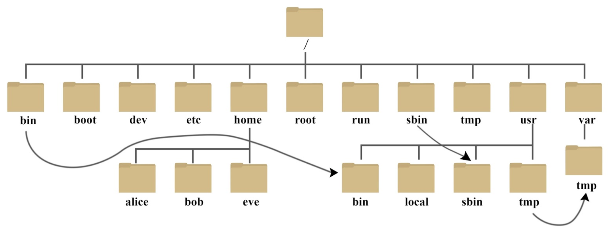

# Lecture 3: Linux file system. Positional parameters. Your first Linux/Bash command. Command precedence

**Last update**: 20200410

### Table of Contents
1. [**Linux** file system](#file_system)  
	A) [File metadata](#file_metadata)     
2. [Positional parameters](#positional_parameters)
3. [Your first **Linux/Bash** commands: **Bash** functions](#first_command)
4. [Command precedence](#precedence)


### 1. **Linux** file system <a name="file_system"></a>

We have already seen how you can make your own files (e.g. with **touch**, **cat** or **nano**), and your own directories (with **mkdir**). The organization of files and directories in **Linux** is not arbitrary, and it follows some common, widely accepted, structure named _Filesystem Hierarchy Standard (FHS)_. The top directory is the so-called _root_ directory and is denoted by ```/``` (slash). You can see its content by executing the following code snippet in the terminal:
```bash
cd /
ls
```
The output could look like:

```bash
bin  boot  dev  etc  home  lib  media  opt  proc  root  run  sbin  sys  tmp  usr  var
```

All files and directories on your computer are in one of these subdirectories. Schematically, the **Linux** file system structure can be represented with the following diagram:



The **Bash** built-in command **cd** ('change directory') is used to move from the current working directory to some other directory. It accepts only one argument, which is interpreted either as an _absolute path_ to the new directory (if the argument starts with ```/```), or as a _relative path_ to the new directory (relative to your current working directory). If you use **cd** without any argument, the argument is defaulted to the home directory. Due to their special meanings, the only characters that cannot be part of a directory name are ```/``` and the null byte ```\0```. 

If you get confused where you are at the moment in the **Linux** file system (i.e. where is your current working directory in the overall file system hierarchy), you can always get that information either from **Bash** built-in command **pwd** ('print working directory'):

```bash
pwd
```
or by referencing the content of environment variable **PWD**, which is always set to the absolute path of your current working directory:
```bash
echo $PWD
```
Both versions return the same answer in all cases of practical interest. However, and as a general rule of thumb, it is always much more efficient to get information directly from the environment variable like **PWD**, than to retrieve and store in a variable the same information by executing the command, via the so-called _command substitution operator_ (more on this later).

The most important directories in the **Linux** file system structure are:

* ```/bin``` : essential binaries needed for system functioning at any run level
* ```/usr/bin``` : binaries used by all locally logged in users
* ```/usr/sbin``` : binaries used only with superuser (root) privileges
* ```/dev``` : location of special or device files
* ```/etc ``` : system-wide configuration files 
* ```/home``` : holds user-specific accounts, personal area for each user 
* ```/proc``` : kernel and process information
* ```/tmp``` : temporary files

We have already used **Linux** commands **date** and **touch**. But to which physical executables (binaries), stored somewhere in the file system, these two commands correspond to? You can figure that out by using the command **which**:
```bash
which date
/bin/date
```


```bash
which touch
/usr/bin/touch
```
It is completely equivalent to execute in the terminal the command name, e.g. **date**, or the full absolute path to the corresponding executable:
```bash
date
Mon Apr 27 16:12:06 CEST 2020
```
is the same as:
```bash
/bin/date
Mon Apr 27 16:12:06 CEST 2020
```
It would be very tedious and impractical if each time we would like to use some command, we would need to type in the terminal the absolute path to its executable sitting somewhere in the **Linux** file system, both in terms of typing and in terms of memorizing the exact locations. This is precisely where **Bash** (or any other **shell**) is extremely helpful --- **shell** finds the correct executable in the file system for us, after we have typed only the short command name in the terminal, and executes it. Clearly, something is happening here behind the scene: How does **shell** know which physical executable in the file system is linked with the short command name you have typed in the terminal? Hypothetically, we could also have another version of **date** command sitting somewhere else in the file system, e.g. in the directory ```/usr/bin/date```. Then there is an ambiguity, since after we have typed in the terminal **date**, it is not clear whether we want ```/bin/date``` or ```/usr/bin/date``` to be executed. 

This is resolved with a very important environment variable **PATH**. To see its current content, simply type:

```bash
echo $PATH
```
The output could look like this:
```bash
/home/abilandz/bin:/usr/local/sbin:/usr/local/bin:/usr/sbin:/usr/bin:/sbin:/bin
```
This output looks messy, but in fact it has a well-defined structure and is easy to interpret. In the above output, we can see absolute paths to a few directories, which are separated in this context with the field separator ```:``` (colon). The directories specified in the environment variable **PATH** are extremely important, because only inside them **Bash** will be searching for a corresponding executable, after you have typed the short command name in the terminal. Literally, the command **date** works because the directory **/bin**, where its corresponding executable ```/bin/date``` sits, was added to the content of **PATH** variable. The order of directories in **PATH** variable matters: When **Bash** finds your executable in some directory specified in **PATH**, it will stop searching in the other directories specified in **PATH**. The priority of the search is from left to right. Therefore, if you have two executables in the file system for the same command name, e.g. ```/bin/date``` and ```/usr/bin/date```, and if the content of **PATH** is as in the example above, after you have typed in the terminal **date**, **Bash** would try first to execute ```/usr/bin/date``` and not ```/bin/date```, because ```/usr/bin``` is specified before ```/bin``` in the **PATH** variable. However, since there is no **date** executable in ```/usr/bin```, **Bash** continues the search for it in ```/bin```, finally finds it there, and then executes ```/bin/date``` . 

By manipulating the ordering of directories in **PATH** variable, you can also have your own version of any **Linux** command --- just place the directory with your own executables at the beginning of **PATH** variable, and then those directories will be searched first by **Bash**. For instance, you can have your own executable for **date** in your local directory for binaries (e.g. in ```/home/abilandz/bin```). Then, you need to redefine **PATH** in such a way that it has your personal directory with higher priority, when compared to standard system-wide directories for command executables (like ```/bin```, ```/usr/bin```, etc.). This is achieved with the following standard code snippet:

```bash
PATH="/home/abilandz/bin:${PATH}"
```
With this syntax, your personal executables in ```/home/abilandz/bin``` are prepended to the current content of **PATH**, and will have therefore the highest priority in the **Bash** search. 

For the lower priority of your executables, use an alternative standard code snippet:

```bash
PATH="${PATH}:/home/abilandz/bin"
```

In this example, you have appended your executables to what is already set in **PATH** --- this way you indicate that you want to use your own version of some standard, system-wide, **Linux** command only if its executable is not found by **Bash**. As always, if you want to make such definitions permanent in your terminal, add the above redefinitions of **PATH** into ```~/.bashrc``` file.

From the above explanation, it is clear that if you unset the **PATH** variable, all commands will stop working when you type them in the terminal, because **Bash** does not know where to search for the corresponding executables.

We finalize the explanation of **PATH** variable with the following concluding remarks:

* The search for the corresponding executable, after you have typed the short command name in the terminal, is optimized in the following ways: 

  * Not all the files in the specified directories in **PATH** are considered during the search --- only the files which have _execute permission_ (```x```) are taken into account by **Bash** (more on this in a moment!);

  * The recently used commands are _hashed_ in the table --- this table is then looked up first by **Bash** after you type the command name in the terminal. To see the current content of the hash table, just type **Bash** built-in command **hash** in the terminal:

    ```bash
    hash
    ```
    
    The output could look like:
    
    ```bash
    hits    command
       4    /usr/bin/which
       5    /usr/bin/git
       1    /bin/date
       2    /bin/cat
       6    /bin/ls
    ```
    
    Cleary, the hash mechanism adds it a lot to the efficiency of commands' usage in **Linux**. Each time you login for the first time on computer the hash table is empty. Each new terminal keeps its own hash table.

* The **PATH** search can be skipped by the user. In particular, when the command name contains the ```/``` (slash) character, not necessarily at the beginning of the name, **Bash** will not perform the search for the corresponding executable --- underlying assumption is that you have now yourself specified the path in the file system, either absolute or relative, to the corresponding executable. In this case, **Bash** tries to execute that command name on the spot. This explains the standard syntax to run the command whose executable is in your current directory: 

  ```bash
  ./someCommand
  ```

  In this context, the dot ```.``` is a shortcut syntax for the absolute path to the current working directory (the analogous shorthand notation for the parent directory is ```..```). With the above syntax, even if the command **someCommand** with a different implementation exists in some directory stored in **PATH**, it will never be searched for and executed, because there is ```/``` in the above command input. 

Some frequently used **Linux** commands to work within the file system are:

* **cp** : copy file(s)
```bash
cp file1 file2 # copying and renaming a file
cp file1 file2 ... someDirectory # copying two or more files in someDirectory  
                                 # the names of original files are preserved
```
Files and directories in the arguments of **cp** can be specified either with the absolute or the relative paths. This is true in general for all commands which take files and directories as arguments. 

* **cp -r** : copy directory and preserve its subdirectory structure
```bash
cp -r directory1 directory2 # this will copy the whole first directory into  
                            # a new subdirectory of the second directory
```

* **rm** : delete file(s)
```bash
rm file1 file2 ... # delete the specifed files
```
Use **rm** with great care, because after you deleted the file, there is no way back!

* **rm -rf** : delete one or more directories
```bash
rm -rf dir1 dir2 ... # delete the specified directories
```
Flag **-r** ('recursive') is needed to indicate that you want to delete all subdirectories recursively, **-f** ('force') is needed to avoid the prompt message which would ask you for the deleting confirmation of each file separately. Use **rm -rf** with the greatest possible care, because after you have deleted the directory, there is no way to get back any file that was in that directory!

* **mv** : move or rename file(s)
```bash
mv file1 file2 # moving, if two files are not in the same directory
               # renaming, if two files are in the same directory
```
The command **mv** uses the same syntax for directories (no additional flags are needed).

* **du -sh** : ('disk usage') : summary (flag **-s**) for the size of directory in the human-readable (flag **-h**) format 
```bash
du -sh ${HOME} # prints how much disk space your home directory is taking
967M
du -h --max-depth=1 ${HOME} # the size of directory, and differentially 
                            # of its subdirectories
du -h --max-depth=2 ${HOME} # the size of directory, differentially of its 
                            # subdirectories and all sub-subdirectories
```

* **df -h** : ('disk free') : get the used disk space of all disks
```bash
df -h # get the status of all disks on your computer 
file system      Size  Used Avail Use% Mounted on
/dev/sda1        1.8T  1.6T  132G  93% /
```

* **stat** : display the detailed metadata of file or directory
```bash
stat Lecture_2.md # just specify the abs. or rel. path to file as an argument
  File: Lecture_2.md
  Size: 97805           Blocks: 384        IO Block: 4096   regular file
Device: 2h/2d   Inode: 12947848928707821  Links: 1
Access: (0666/-rw-rw-rw-)  Uid: ( 1000/abilandz)   Gid: ( 1000/abilandz)
Access: 2020-04-15 21:05:26.002857000 +0200
Modify: 2020-04-28 11:44:53.454187100 +0200
Change: 2020-04-28 11:45:14.515681300 +0200
 Birth: -
```
Later we will learn how to parse through and extract programmatically from any command output (or from any physical file) only the information we need. For the time being, if you want to get only the size of the file in bytes, use:
```bash
stat -c %s Lecture_2.md
97805
```
For the size of a directory, use instead **du -sh** as explained above. As you can see from the output of **stat**, the example file ```Lecture_2.md``` is characterized by three timestamps: **Access**, **Modify** and **Change**. These three timestamps are an important part of file metadata, which we cover next.

#### A)  File metadata <a name="file_metadata"></a>

File metadata is any file-related information besides its content. From the user's perspective, the most important file metadata are _timestamps_, _ownership_ and _permissions_.  

The meaning of three timestamps is as follows:  

* **Access (a)** : last time a file was accessed (opened) and read without any modification   
* **Modify (m)** : last time a file was modified (i.e. its content has been edited)
* **Change (c)** : last time a file's metadata was changed (e.g. permissions)  

These three timestamps are not an overkill, in fact, they enable a lot of very powerful features when searching for specific files or directories in the file system. For instance, by using them, it is possible to list names of all files modified within the last day, to delete all files which were not accessed for more than 1 year, etc. (more on this later).

Next, each file or directory in **Linux** has three distinct levels of ownership:  

* **User (u)** : the person who created the file
* **Group (g)** : the wider group to which the person who created the file belongs to
* **Other (o)** : anybody else   

File ownership becomes extremely handy in combination with file permissions, when it is very simple to set common access rights for any group of other users. 

Finally, each file in **Linux** has three distinct levels of permissions (or access rights):

* **Read (r)** : file can be read
* **Write (w)** : file can be written to (i.e. edited)
* **Execute (x)** : file is executable (i.e. binary, program)

For instance, when you execute
```bash 
ls -al someFile
```
you can get the following example output: 
```bash
-rw-rw-rw- 1 abilandz alice 97805 Apr 28 12:23 someFile
```
It is very important to understand all entries in this output, and how to modify or set some of them. Reading from left to right:

* **Column #1:**  
  * the very first character is the file type : ```-``` is an ordinary file, ```d``` is a directory, ```l``` is soft link, etc.  
  * characters 2, 3 and 4 are fields for ```r```, ```w``` or ```x``` permissions for the user (i.e. for you)   
  * characters 5, 6 and 7 are fields for ```r```, ```w``` or ```x``` permissions for the group (i.e. wider group of people where your account belongs to)   
  * characters 8, 9 and 10 are fields for ```r```, ```w``` or ```x``` permissions for anybody else    
  
* **Column #2:** Number of files (always 1 for files and 2 or more for directories)  
* **Column #3:** The user who owns the file ('abilandz' in this case)
* **Column #4:** The group of users to which the file belongs ('alice' experiment at CERN in this case)
* **Column #5:** The size of the file in bytes (for directories, it has another meaning, it is NOT the size of the directory!) 

The meaning of the remaining columns is trivial. 

File permissions are changed with the **Linux** command **chmod** ('change mode'). This is best illustrated with a few concrete examples:
```bash
chmod o+r someFile.txt
```
After the above command was executed, others (```o```) can (```+```) read (```r```) your file ```someFile.txt```. Whatever was set for ```w``` and ```x``` flags for others, it remains intact. A slightly different notation:

```bash
chmod o=r someFile.txt
```

would ensure that for others, only ```r``` is set, while ```w``` and ```x``` flags are forced to ```-```. In this example:

```bash
chmod go-w someFile.txt
```
group members to which your account belongs to (```g```) and all others (```o```) can not (```-```) modify or write (```w```) to your file ```someFile.txt```. Therefore, after this simple command execution, only you can edit this file!
```bash
chmod u+x someFile.txt
```
With the above syntax, the file ```someFile.txt``` is declared to be an executable and only you as a user (```u```) can (```+```) execute (```x```) it. Remember that only the files which are executables are taken into account by **Bash** when searching through the content of directories in **PATH** variable. Therefore, when making your own **Linux** command, two formal aspects must be always met:

1. the directory containing your executable must be included in **PATH**; 
2. your executable must have ```x``` permission.

Next example:
```bash
chmod ugo+rwx someFile.txt
```
Now everybody (you as a user (```u```), group members (```g```)  and others (```o```)), can read (```r```), modify or write to (```w```), or execute your file (```x```). For directories, you can change permissions in one go for all files in all subdirectories, by specifying the flag ```-R``` ('recursive'), i.e. by using schematically:
```bash
chmod -R some-options-to-change-permissions someDirectory
```

Note that it makes a perfect sense to use ```x``` permission also for directories, because we can then add recursively in one go ```x``` permissions to all files in that directory.

Finally, we clarify that each permission setting can be represented alternatively by a numerical value. The rule is established with the following simple table:

|permission| r  | w  | x  | -  |
|:--:|:--:|:--:|:--:|:--:|
|**value**| 4  | 2  | 1  | 0  |

When these values are added together, the sum is used to set specific permissions. 

For example, if you want to set only 'read' and 'write' permissions, you need to use a value 6, because from the above table, it follows immediately: 4 ('read') + 2 ('write') = 6. If you want to remove all  'read', 'write' and 'execute' permissions, you need to specify 0. 

For convenience, all possibilities are documented in the table:

| value | permission             | standard syntax |
| :--:  | :--:                   | :--:            |
|  7    | read, write and execute| rwx |
|  6    | read and write         | rw- |
|  5    | read and execute       | r-x |
|  4    | read only              | r-- |
|  3    | write and execute      | -wx |
|  2    | write only             | -w- |
|  1    | execute only           | --x |
|  0    | none                   | --- |

**Example:** Make a new file with default permissions, then remove all permissions, and set the permission pattern to ```-rwx--xr--``` , by using both syntaxes described above. With the first syntax, we would have:

```bash
touch file.log # make a new file
# the default permission pattern is: -rw-rw-rw-
chmod ugo-rwx file.log # strip off all permissions
# pattern is now: ----------
chmod u+rwx,g+x,o+r file.log # set new permissions
# the final pattern is: -rwx--xr--
```

With the alternative syntax, we proceed as follows:

```bash
touch file.log # make a new file
# the default permission pattern is: -rw-rw-rw-
chmod 000 file.log # strip off all permissions
# pattern is now: ----------
chmod 714 file.log
# pattern is: -rwx--xr--
```

It practice, it is not needed to remove old permissions and only then to set the new ones --- it was done here that way only for the sake of this exercise, but the old permissions can be directly overwritten.

Before we start developing the new commands from scratch in **Linux**, we need to introduce one very important and fairly generic concept: _positional parameters_ (or _script arguments_).


### 2. Positional parameters <a name="positional_parameters"></a>

In this section we discuss how some arguments to your script can be supplied at execution. This clearly will allow you much more freedom and power in the code development, because nothing needs to be hardcoded in the script body. The very same mechanism can be used also in the implementation of **Bash** functions, as we will see later. We introduce now the so-called _positional parameters_ (or _script arguments_).

**Example:** We want to develop a script named ```favorite.sh``` which takes two arguments: the first one is the name of the collider, the second the name of the experiment. This script then just print something like: 

```bash
My favorite collider is <some-collider>
My favorite experiment at <some-collider> is <some-experiment>
```
The solution goes as follows. In **nano** edit the file ```favorite.sh``` with the following content:
```bash
#!/bin/bash

echo "My favorite collider is ${1}" 
echo "My favorite experiment at ${1} is ${2}"

return 0
```

If you now execute this script as:

```bash
source favorite.sh LHC ALICE
```

the printout looks as follows:

```bash
My favorite collider is LHC
My favorite experiment at LHC is ALICE
```

So how does this work? It is very simple and straightforward, there is no black magic happening here! Whatever you have typed first after ```source favorite.sh``` , and before the next empty character is encountered in the command input, was declared as the 1st positional parameter (or the 1st script argument). The value of the 1st positional parameter is stored in the internal variable ```${1}``` ('LHC' in the above example). Whatever you have typed next, and before the next empty character is encountered, is declared as the 2nd positional parameter, and its value is stored in the internal variable ```${2}``` ('ALICE' in the above example). And so on — in this way you can pass to your script as many arguments as you wish!

Once you fetch programmatically in the body of your script the supplied arguments via variables ```${1}```, ```${2}```, etc. , you can do all sorts of manipulations on them, which can completely modify the behavior of your script. 

Few additional remarks on positional parameters: 

* You can programmatically fetch their total number via the  variable: ```$#```

* You can programmatically fetch them all in one go via the variables: ```$*``` or ```$@``` . In most cases of interest, these two variables are the same. For the purists: ```"$*"``` is equal to ```"$1 $2 $3 ..."```, while ```"$@"``` is equal to ```"$1" "$2" "$3" ...``` . This means that ```"$*"``` is a single string, while ```"$@"``` is not, and this will cause a different behavior when you loop over all entries in ```"$*"``` or ```"$@"``` . But if you drop the double quotes, there is no difference between the content of special variables ```$*``` and ```$@```

* It is also possible to access directly the very last positional parameter, by using the _indirect reference_ ('value of the value') operator ```!``` — the syntax for the last positional parameter is ``` ${!#}```. As a side remark, indirect reference ```!``` is a 'sort of pointer' in **Bash**, and its general usage is illustrated with the following code snippet:

  ```bash
  Alice=44 
  Bob=Alice 
  echo ${Bob} # prints Alice
  echo ${!Bob} # prints 44
  ```

In combination with looping, you can programmatically parse over the all supplied arguments to your script (i.e. there is no need to hardwire in the script that you expect exactly a certain number of arguments, etc.). 

**Example**: Proof of the principle. Below is the script ```arguments.sh```, which uses the **for** loop in **Bash** (to be covered in detail later!), and just counts and prints all arguments supplied to the script:

```bash
#!/bin/bash

echo "Total number of arguments is: $#"
echo "The second argument is: ${2}"
echo "The very last argument is: ${!#}"

for Arg in $*; do
 echo "${Arg}"
done

return 0
```

If you execute this script for instance as: 
```bash
source arguments.sh a bbb cc
```
you will get as a printout:
```bash
Total number of arguments is: 3
The second argument is: bbb
The very last argument is: cc
a
bbb
cc
```
By using this functionality, you can instruct a script to behave differently if certain options or arguments are supplied to it. Since this is clearly a frequently used feature, the specialized built-in **Bash** command exists to ease the parsing and interpretation of positional parameters (see the documentation of advanced **getopts** ('get options') command).


### 3. Your first **Linux/Bash** command: Bash functions <a name="first_command"></a>

As the very first respectable version of your own command in **Linux/Bash**, which can take and interpret arguments, provide exit status, has its own environment, etc., we can consider **Bash** function. 

Functions in **Bash** are very similar to scripts, however, the details of their implementations differ. In addition, functions are safer to use than scripts, since they have a well-defined notion of _local environment_. This means basically that if you have the variable with the same name in your current terminal session, and in the script or in the function you are executing, it's much easier to prevent the clash of these variables if you use functions. In addition, usage of functions to great extent resembles the usage of **Linux** commands, and it is in this sense, that your first function developed in **Bash** can be also treated as your first **Linux** command! 

Example implementation of **Bash** function could look like:

```bash
#!/bin/bash

function Hello
{
 # This function prints the welcome message 
 # Usage: Hello <some-name>

 echo "Hello"
 local Name="${1}"
 echo "Your name is: ${Name}"

 return 0

}
```

Save the above code snippet in the file ```functions.sh```. Then, in order to call your function **Hello**, just source that file:

```bash
source functions.sh
```

From this point onward, the definitions of all functions in the file ```functions.sh``` are loaded in the computer's memory, and can be in the current terminal session used as any other **Linux** or **Bash** built-in command. To check this, try to execute:
```bash
Hello Alice
```

The output is:

```bash
Hello
Your name is: Alice
```

When compared to the script implementation, there are few differences:

* Usage of keyword **function** (an alternative syntax exists, ```someName()```, but it is really a matter of taste which one you prefer)
* Body of the function must be embedded within ```{ ... }```
* For any variable needed only within the function, use the keyword **local**, to restrict its scope only within the body of the function. In this way, you will never encounter the clash between variables that were defined with the same name in the function, and in the terminal or in some other code from where you have called the function. If a variable is defined in the function without the keyword **local**, call to that function can spoil severely the environment from which the call to the function was executed, which can have dire consequences... As a rule of thumb, each variable you need only in the function, declare as **local**

The rest is the same as for the scripts:

* Functions accept arguments in exactly the same way as scripts, via special ```${1}```, ```${2}```, ... variables
* You can call a function within another function, but only if it was defined first --- order of implementation matters in scripting languages!
* Do not forget to provide the return value at the end of the function, which sets its exit status. For most of the time functions are executed equivalently as commands, and then their exit status clearly matters
* Typically, you implement all your functions in some file, let's say ```functions.sh```, and save it in your home directory (or anywhere else). Then, at the end of ```${HOME}/.bash_profile``` and ```${HOME}/.bashrc``` you insert the line:

```bash 
source ${HOME}/functions.sh
```
If you have added the definitions of your personal functions in ```${HOME}/.bashrc``` , your functions from the file ```functions.sh``` will be automatically loaded in computer's memory and are ready for usage in each terminal session, just as **Linux** commands --- in this sense the first **Bash** function you have written can be regarded also as your first **Linux** command!


### 4. Command precedence <a name="precedence"></a>

We have seen that your very first input in the terminal, before the empty character is encountered, will be interpreted by **Bash** as the command name, where the command name can stand for an alias, built-in **Bash** command (e.g. **echo**), **Linux** command (e.g. **date**), **Bash** functions (e.g. **Hello** from the previous example), etc. But what happens if we have for instance alias and **Linux** command named in the same way? For instance:
```bash
alias date='echo "Hi"'
```
If after this definition we type in the terminal **date**, we get:
```bash
date
Hi
```
What now? Have we just accidentally overwritten and lost permanently the command **date**? Not quite, what happened here is that the alias execution got precedence over the **Linux** command named in the same way. But both the alias **date** and the command **date** now exist simultaneously on your computer.

The command precedence rules in **Bash** are well defined and strictly enforced with the following ordering:

1. aliases  
2. **Bash** keywords (**if**, **for**, etc.)  
3. **Bash** functions  
4. **Bash** built-in commands (**cd**, **type**, etc.)  
5. scripts with execute permission and **Linux** commands (at this level, the precedence is determined based on the ordering in **PATH** variable, as we already discussed)   

Given the above ordering of command precedence, some care is definitely needed when introducing new aliases or developing new functions in **Bash**, to avoid the name clashes with the existing **Linux** commands. 

Additional profiling of command precedence can be achieved with **Bash** built-in commands **builtin**, **command**, and **enable** (check their 'help' pages in **Bash**). For instance, we can force that always the **Bash** built-in command **echo** is executed, even if the alias or function named **echo** exists, with the following syntax:

```bash
builtin echo some-text
```

**Reminder:** If you have overwritten accidentally **Linux** command with some alias definition (like in the above example for **date**), use the command **unalias** to revert back permanently:

```bash
unalias someAliasName
```

or temporarily with

```bash
\someAliasName
```

In the case you are not sure to which one of the five cases above the command you intend to use corresponds to, use the **Bash** built-in command **type**:

```bash
type date
date is /bin/date
```

The above line tells that **date** is **Linux** command whose executable is ```/bin/date```. 

Two other examples in this context:

```bash
type echo
echo is a shell builtin
```

```bash
type ll
ll is aliased to `ls -alF'
```

For the **Bash** functions, the command **type** also prints the source code of that function. For instance, for the function **Hello** discussed previously you would get:   
```bash
type Hello
Hello is a function
Hello ()
{
    echo "Hello";
    local Name="${1}";
    echo "Your name is: ${Name}";
    return 0
}
```

This is quite handy, because if you have forgotten the details of the implementation of this particular function, you do not need to dig into the file ```functions.sh``` where a lot of your additional functions can be implemented in the meanwhile. 

Note also that this way you can see immediately the implementation of some **Bash** functions which were not developed by you (therefore, you have no idea where in the file system is the file with their source code), but are nevertheless available in your terminal session:

```bash
type quote
quote is a function
quote ()
{
    local quoted=${1//\'/\'\\\'\'};
    printf "'%s'" "$quoted"
}
```

Finally, it can happen that accidentally you delete the file ```functions.sh```. If this file was sourced before you deleted it accidentally, you can still retrieve the implementations of your functions from the computer's memory with **type**, and then just redirect the output to some file.
