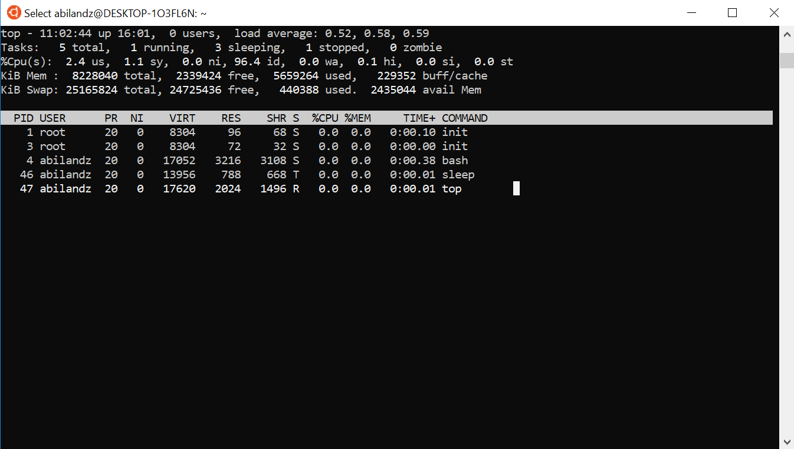

# Lecture 7: Escaping. Quotes. Handling processes and jobs. 

**Last update**: 20200608

### Table of Contents
1. [Escaping: ```\```](#escaping)
2. [Quotes: ```'...'``` and ```"..."```](#quotes)
3. [Handling processes and jobs](#handling_processes_and_jobs)


### 1. Escaping: ```\``` <a name="escaping"></a>

Some characters in **Bash** have a special meaning. As an elementary example:

```bash
echo $Var
```

would reference the content of variable named ```Var``` since the variable is preceded with the special character ```$```, but ```$``` itself would not appear in the printout. To see also the special character ```$``` in the printout, we need to _escape_ (or kill) its special meaning with the backslash character ```\```. 

The escaping mechanism in **Bash** is illustrated  in the following example:
```bash
Var=44
echo $Var
echo \$Var
```
The above code snippet produces the following output:
```bash
44
$Var
```
It is possible in the same way to escape the special meaning of any other special character, and in any other context (not necessarily only in their printout as demonstrated here). If there are multiple special characters in the input expression, they can to be escaped one-by-one with backslash ```\```. 

As another example, we consider the double quotes ```"..."```, which also have a special meaning in **Bash** (clarified in the next section!) and are not printed by default:
```bash
echo "Hi "there""
Hi there # no quotes in the printout
```
However, we can escape the special meaning of two inner-most quotes, and they will show up in the printout:
```bash
echo "Hi \"there\""
Hi "there"
```
Finally, we can also escape the special meaning of two outer-most quotes:

```bash
echo \"Hi \"there\"\"
"Hi "there""
```

As another example, we compare: 

```bash
echo "Today is: $(date)"
Sat Jun  6 19:24:20 CEST 2020
```
with 
```bash
echo "Today is: \$(date)" 
Today is: $(date) 
```

In the second example nothing happened, because the command substitution operator was escaped.

We have already seen that in **Bash** the command input is terminated either with semicolon ```;``` or with the new line. Frequently, the command input needs to span over a few lines in the terminal, and in order to handle such a case, we need to escape the end of the line, i.e. we need to kill the special meaning of new line. To achieve that, it suffices to place backslash ```\``` at the very end of the line:

```bash
echo "Welcome \
to \
the \
lecture PH8124."
```

This produces the one-line output:

```bash
Welcome to the lecture PH8124.
```

When used to escape the new line, backslash ```\``` must be the very last character on that line. The frequent mistake occurs when ```\``` is followed by an empty character, because then it will merely escape the special meaning of an empty character, and not the special meaning of new line. 

Alternatively, we can escape the meaning of special characters with strong (single) quotes ```'...'```, which is the topic of next section.


### 2. Quotes: ```'...'``` and ```"..."``` <a name="quotes"></a>

**Strong (single) quotes**

In complex expressions, containing a huge number of special characters, it becomes quickly impractical to escape the special meaning of each character separately with ```\```. Instead, they can be escaped all in one go by embedding the whole expression within strong (single) quotes ```'...'``` . This is the primary use case of strong quotes, and their meaning can be literally understood with the following phrase: _what you see is what you get_. 

For instance:

```bash
Var1=44
Var2=440
echo '$Var1   $Var2'
```

The printout is literally:

```bash
$Var1   $Var2
```

Neither variable was referenced, because the special meaning of both ```$```'s was killed with strong quotes, and the exact number of empty characters was also preserved in the printout. 

Strong quotes are used frequently to pass the file or directory whose name contain empty characters:

```bash
ls 'crazy name'
```

Without strong quotes, the command **ls** would interpret 'crazy' and 'name' separately, as two different arguments. 

To illustrate the importance of strong quotes, consider the following example:

```bash
echo 100 > 10 # WRONG!!
```

We wanted to print a literal inequality, ```100 > 10```, on the screen but the above code snippet didn't produce any printout on the screen. Instead, something completely different has happened: **echo** printed only ```100``` but that was redirected immediately into the file named ```10```. We can circumvent this problem with:

```bash
echo '100 > 10'
100 > 10
```

Single quotes may not occur between single quotes, even when preceded by a backslash.

As the last remark, strong quotes appear in a rarely used context, which is here outlined just for completeness sake. Some characters cannot be represented with the literal syntax, instead we need to use _backslash-escaped characters_ for them. The best examples are new line and tab space, which are represented with '\n' and '\t', respectively. However, neither **Bash** nor lot of **Linux** commands by default interpret such backslash-escaped characters. For instance:

```bash
echo "Hi\nthere"
```

prints literally:

```bash
Hi\nthere
```

We need to instruct **echo** to interpret backslash-escaped characters by supplying a flag '-e':

```bash
echo -e "Hi\nthere"
```

The printout it now:

```bash
Hi
there
```

Similarly:

```bash
echo -e "Hi\tthere"
```

prints the tab space: 

```bash
Hi      there
```

and so on.

In general, we can force **Bash** to interpret directly the backslash-escaped characters by using the following generic syntax**: **

```bash
$'whatever'
```

With this syntax, we do not rely any longer on the details of command implementation, and whether there exists some option, like '-e' for **echo**, which will instruct the command to interpret backslash-escaped characters. For instance:

```bash
echo $'Hi\nthere'
```

will print:

```bash
Hi
there
```

Now **Bash** has interpreted the special meaning of '\n' character, not the **echo** command.

**Example:** Prompt the user with the following multi-line question in **read** command:

```bash
Dear User,
do you want to continue [Y/n]? 
```

The problem here is that the command **read**, unlike **echo**, does not have a specialized flag to interpret the backslash-escaped characters. Therefore, the simplest solution is to use ```$``` in combination with single quotes:

```bash
read -p $'Dear User,\ndo you want to continue [Y/n]? ' Answer
```

In the next section, we clarify the meaning of weak (double) quotes ```"..."```. 


**Weak (double) quotes**

Unlike the strong quotes, the weak (double) quotes ```"..."``` preserve the special meaning of some special characters, while the special meaning of all others is stripped off. Just like within strong quotes, within double quotes the empty character does not retain its special meaning, i.e. it is not any longer the default field separator. The exact number of empty characters is preserved within weak quotes:

```bash
echo "a b    c"
echo  a b    c
```

The output is:

```bash
a b    c
a b c
```

We can now compare the effect of two types of quotes in the following example:

```bash
Var1=44
Var2=440
```

* no quotes:   

  ```bash
  echo $Var1   $Var2
  44 440
  ```
  
* strong quotes:   

  ```bash
  echo '$Var1   $Var2'
  $Var1   $Var2
  ```
  
* weak quotes:   

  ```bash
  echo "$Var1   $Var2"
  44   440
  ```

In each case we got a different result. Within double quotes the content of variables is referenced with the special character ```$``` , and the exact number of empty characters is preserved. 

The special meaning of the following special characters or constructs are preserved within weak quotes ```"..."```:

* ```$``` : referencing content of variable   
* ```$( ... )``` : command substitution operator
* ```$(( ... ))``` : arithmetic expression evaluation
* ```\``` : backslash preserves its special meaning within double quotes only in some cases, for instance, when it is followed by ```$```, ```"```, `\`, or newline.

Nested double quotes are allowed as long as the inner ones are escaped with ```\``` . For instance, 

```bash
echo "\"test\""
```

prints 

```bash
"test"
```

as expected. On the other hand, single quotes have no special meaning within double quotes:

```bash
Var=44
echo "'$Var'"
```

prints 

```bash
'44'
```

To memorize the rules easier, to leading order only the **Bash** constructs which begin with ```$``` or ```\``` keep their special meanings within double quotes.


### 3. Handling processes and jobs <a name="handling_processes_and_jobs"></a>

In Linux, an executable stored on disk is called a program. Loosely speaking, program loaded into memory and running is called a proces, while job is more specifically a process which is started by a shell. A group of processes launched from the shell can be also considered as a job. Therefore, a job is a shell-only concept, while process is a more general, system-wide, concept. There are specific **Bash** and **Linux** commands which keep track only of jobs launched from the current shell, while on the other hand there are commands which can keep track of all processes running on the computer, therefore it's important to understand their differences and in which context those commands shall be used.

Jobs launched from the shell can be divided in two important groups:  'foreground' jobs and 'background' jobs. Foreground jobs are jobs with control of the terminal, i.e. after they are launched from the shell and while they are running nothing else can be done in the current shell session by the user. The control over the terminal is regained only when the foreground job has finished its execution. The background jobs are jobs without control of the terminal, and they are typically launched on multicore machines, when the parallelization of jobs makes perfect sense and improves a lot the overall execution time. While jobs launched from the current terminal session are running in the background, in that terminal session we have the full control over the terminal and can do whatever we want.

By default, any job we launch from the terminal is run in the foreground. If we want to submit job execution to the background, we need to end the command line input with the special character ```&``` . For testing purposes in this section we use the dummy command **sleep** , which launches a perfectly valid process even if it does nothing besides blocking the execution of subsequent commands for the specified time interval. Whatever is demonstrated here for the **sleep** command, applies to any other command (where command is meant in the broader sense, i.e. it includes also functions, scripts, code blocks, etc.). 

To illustrate the difference between foreground and background job execution, please try first:

```bash
sleep 10s
```

With this syntax, command **sleep** runs in the foreground, and essentially it prevents you from doing anything else in the terminal for 10s. On the other hand:

```bash
sleep 10s &
```

by using special character ```&``` at the end of command input, the command **sleep** executes in the background, and you can continue immediately to execute another commands in your current shell. When in your script you send a command to the background with ```&```, that command essentially starts another process in parallel (the processes forks off). Note however, that the 'stdout' stream of the forked process is still attached to the shell from which the job was sent to the background, which means that any output will still appear in your terminal, even if the job is running in the background. This sometimes leads to surprise printout in the terminal, if the 'stdout' stream of background job wasn't redirected somewhere else (e.g. to some file or to ```/dev/null```). 

It is also perfectly feasible to launch in the same command input multiple processes in separate background sessions, for instance:

```bash
sleep 10s & sleep 20s & sleep 30s &
```

With such examplary command input, we have three instances of **sleep** command running in the background, in parallel.

Next we will learn how processes can be manipulated programmatically and directly either via their Process ID (PID) or Job Number.

#### Process IDs and Job Numbers

Linux gives all processes the number, called Process ID (PID), when they are created. On the other hand, shell gives all jobs also the number, called Job Number, when they are launched in the current shell. Therefore, each process has unique system-wide PID, while job numbers are unique only within the current shell. Each shell session keeps track of its own job numbers. In general, we can manipulate programmatically the process from any shell via its PID, and from the current shell both with its PID and job number.

Example:

```bash 
sleep 10m &
[1] 15
```

In the above example, number ```15``` is system-wide PID, assigned by operating system to the command **sleep 10m** executed in the background. This information is accessible in any shell session running on the computer. If multiple users are using the same computer, PID is unique for all processes of all users, which is essential ingredient for multitasking.

On the other hand, ```[1]``` is the job number, assigned by shell (not by the operating system), to the command **sleep 10m** sent to the background. This information is known only to the shell in which this command was executed. In particular, ```[1]``` in this example indicates that this is the first job sent to the background in the current shell session, and which is still running. When job execution of all jobs running in the background terminates, the job counter is reset, and ```[1]``` can be assigned to some other job sent to the background later.

Two most frequently used commands to handle running processes programmatically are **jobs** (shell-only) and **top** (system-wide). In order to get the list of running jobs which were submitted only from the current terminal, please use: 

```bash
jobs -l
```

The output of this command might look for instance: 

```bash
[1]+    15 Running                 sleep 10m &
```

The following output literally means that in the current terminal session there is one job launched with the command input **sleep 10m &** , which is at the moment in the state 'Running' (other possible states are 'Done', 'Terminated', 'Hangup', 'Stopped', 'Aborted', 'Quit', 'Interrupt', etc., more on this later), whose job number is ```[1]``` and whose PID is ```15``` . If we execute another command, e.g. 

```bash
sleep 20m &
jobs -l
```

we now see both of them running in the background (remember, we use **sleep** for its simplicity, but what is explained here applies to any other command):

```bash
[1]-    15 Running                 sleep 10m &
[2]+    17 Running                 sleep 20m &
```

In the above output, symbol ```+``` next to the job number indicates the most recent job sent to background, while symbol ```-``` indicates the one before the most recent job sent to the background. Only these two jobs get special notation in the output of **jobs** command.

As the very basic example, we now demonstrate how the job can be terminated programmatically. If you want to terminate the particular job, you need to use the shell built-in command **kill**, and you can do it either by specifying job number as an argument:

```bash
kill %2
```

 or via PID:

```bash
kill 17
```

Note the usage of percentage symbol ```%``` in the first example: Without it, shell would attempt to kill the process with system-wide PID 2. Only after the percentage symbol ```%``` is being used, shell will interpret the following number as the job number, which is specific and known only to the current shell. Note also that only the second version can be used from any shell. Later we will see that command **kill**, despite its name, can do much more than mere termination of running jobs.

We have seen how we can get the list of all background jobs launched from the current shell with **jobs -l** command. With the more general command named **top** we can get the list of all running processes on the computer, from all users, and not only background jobs.

After executing in the terminal:

```bash
top
```

the output could look like this:



The **top** command continuously updates the terminal display with the summary of current status of system resources followed by the list of most CPU-intensive processes (default ordering). The first column contains the PID of each running process, followed by user name, priority of the process, 'nice' value of the process, memory and CPU consumption, total running time, etc. In order to parse output of **top** programmatically, or to redirect it in some file, we need to run command **top** in the batch (text) mode via:

```bash
top -b
```

Now the following constructs make perfect sense:

```bash
top -b > topOutput.log # dump the output of 'top' command in external file
top -b | grep ${USER} # filter out only information relevant for your own processes
```

The command **top** can be run from any shell instance on the computer, and its printout to large part will be the same. On the other hand, the output of the **jobs** command will be completely different on different shell instances. Closely related to **top** command is **ps** command (see corresponding 'man' pages), which gives only a current snapshot of currently active processes, while **top** is being continuosly updated and can be used interactively.

To conclude this section, we remark that one very important process is always listed in the output of **top** command and is called 'init'. The process 'init' is the grandfather of all processes on the system because all other processes run under it. Every process can be traced back to 'init', and it always has a PID of 1.

#### Moving job execution from background to foreground, and vice versa

We have already seen how the job execution can be sent to the background by appending the special character ```&``` to the command input. The similar functionality can be achieved with the **Bash** built-in command **bg**, only the syntax and typical use cases are slightly different. Typically, the command **bg** is used when you started the job in the foreground, but then realized that you need to regain the control over the terminal in order to do something else, while that job is executing in parallel. This can be achieved by following these two generic steps:

1. Suspend the foreground job with ```Ctrl+Z```
2. Resume (not restart!) the suspended job in the background with **bg** command

This is best illustrated with the following example. Imagine that you launched in the foreground the following command (but it can be any other command input):

```bash
sleep 10m
```

Now you terminal is blocked for 10 minutes since command **sleep** (or any other command) is running in the foreground. You can suspend the execution of command **sleep** by pressing ```Ctrl+Z``` and regain the control of the terminal. After you have the control over the terminal again, you can start executing other commands. For instance, you can check now the status of the jobs in the standard way, e.g.:

```bash
jobs -l
[2]+    15 Stopped                 sleep 10m
```

After pressing ```Ctrl+Z``` the job was not killed or terminated, it was suspended. The job remains exactly the same as it was at the time of the suspension (e.g. the same memory consumption). The suspended job does literally nothing until it's resumed. From user's perspective, the job looks like being paused (in the output of command **jobs** the state description with 'Stopped' is a bit misleading, 'Paused' or even 'Frozen' would be a much better word to describe the state of job after you hit ```Ctrl+Z```). The suspended job will no longer use any CPU,  but it will, however, still claim the same amount of RAM. This last fact implies that we can re-start it anytime and it will continue where it stopped.

To restart the suspended job in the background, we can use the following generic syntax:

```bash
bg %job-number
```
or
```bash
bg %command-name
```

E.g. to re-start in the background the above **sleep** command, we need to use:

```bash
bg %2
```
or another variant:
```bash
bg %'sleep 10m' # for composite command input, we need to enclose everythig within strong quotes
```

If we inspect now the status of jobs in the current shell, we see the following:

```bash
jobs -l
[2]+    15 Running                 sleep 10m &
```

This is precisely what we wanted  to achieve: We have suspended the job running in the foreground which was blocking the terminal input with ```Ctrl+Z```, and then re-started its execution in the background with ```bg %job-number```. While that job is now running in parallel in the background, we can do our thing in the terminal again! As the last remark, we indicate that the command **bg** as an argument accepts job number, and not PID, of process.

Closely related command is **Bash** built-in command **fg**. This command moves the jobs running in background to the foreground. Before discussing its syntax, we first stress out the following important thing: There is no way you can bring to foreground a process in your current shell instance if it was not started in the background from your current shell instance. You can't take over a process that was started in a different shell. There are programs available that allow you to move other programs around from one shell instance to another, the most common one is **screen**. If you didn't start your process inside of a **screen** session, then you won't be able to take it over in another shell instance.

After using command **fg**, the background job is taking control over the terminal , i.e. the job will start to act just as you have launched it without ```&```.  Generically, its syntax is the following:
```bash
fg %job-number
```
or
```bash
fg %command-name
```
Is used without arguments, the command **fg** brings the most recent job sent to the background to foreground. We illustrate its usage in the following simple example. First, we launch the command **sleep** (or any other command) in the background:
```bash
sleep 30m &
```
The relevant line in the output of **jobs -l** command might look like:
```bash
[5]   5194 Running                 sleep 30m &
```
If we want to bring to foreground the execution of this background job, we need to use either:
```bash
fg %5
```
or 
```bash
fg %'sleep 30m'
```
After this, the job **sleep 30m** is running in the foreground and taking control over the terminal. We need to wait that job to terminate, before we can launch any other job from that terminal session.

We finalize this section by mentioning that **Bash** has the following two special variables relevant for the material presented here:

*  ```$$``` variable holds the PID of the script in which it appears
*  ```$!``` is the PID of last job sent to or running in background

For instance, we can programatically close the current terminal session by using:
```bash
kill -9 $$
```
This is handy to place at the end of the script, if upon the script execution, we do not need that terminal session any longer. The meaning of option ```-9``` to command **kill** will be clarified a bit later.

The second special variable, ```$!```, has a very neat use case in combination with **Bash** built-in command **wait**. If you want to wait in your script with the further execution, only until the last job you sent to background finishes, use the following construct:

```bash
wait $!
```
If you use command **wait** without arguments in your script
```bash
wait
```
the script execution will wait until all jobs running in the background are terminated. This feature is very handy on multicore machines: If your script is facing some CPU intensive task, you can split that task across multiple processes (e.g. fragment the input dataset which needs to be processed in smaller chunks), and then send each process analysing only one chunk of data in the background. While those processes are running in parallel in background, your main script waits with the further execution. Only after all background jobs have finished, your script will proceed automatically with the further execution. Clearly, such a feature can considerably speed up the script execution, and all this can be achieved programmatically.

#### Sending signals to the running processes

We have already seen that we can suspend the running job by hitting ```Ctrl+Z```, and that we can terminate the running job with ```kill -9 <job-PID>```. Conceptually, there is no much of a difference in what is happening in these two cases, and these two examples are just a small subset of _signals_ that we can send to the running process. In this section we cover in detail from the user's side how the signals can be sent programmatically to the running processes, and therefore modify its running conditions. In the next section, we will cover this topic from programmer's side, i.e. we will discuss the code which needs to be implemented so that your process can receive and handle the signals. 

Loosely speaking, a signal is a message that a user or a process sends to another running proccess when some abnormal event takes place or when we want another process to do something. As we already saw, two processes can communicate with pipes ```|```, signals are another way for running processes to communicate with each other.

All available signals have: 

* numbers (starting from 1)
* names

To get the list of all signals on your system by name and number, please type:
```bash
kill -l 
```
The outpout could look like:
```bash
 1) SIGHUP        2) SIGINT       3) SIGQUIT      4) SIGILL       5) SIGTRAP
 6) SIGABRT       7) SIGBUS       8) SIGFPE       9) SIGKILL     10) SIGUSR1
11) SIGSEGV 	12) SIGUSR2     13) SIGPIPE     14) SIGALRM     15) SIGTERM
16) SIGSTKFLT   17) SIGCHLD     18) SIGCONT     19) SIGSTOP     20) SIGTSTP
21) SIGTTIN     22) SIGTTOU     23) SIGURG      24) SIGXCPU     25) SIGXFSZ
26) SIGVTALRM   27) SIGPROF     28) SIGWINCH    29) SIGIO       30) SIGPWR
31) SIGSYS      34) SIGRTMIN    35) SIGRTMIN+1  36) SIGRTMIN+2  37) SIGRTMIN+3
38) SIGRTMIN+4  39) SIGRTMIN+5  40) SIGRTMIN+6  41) SIGRTMIN+7  42) SIGRTMIN+8
43) SIGRTMIN+9  44) SIGRTMIN+10 45) SIGRTMIN+11 46) SIGRTMIN+12 47) SIGRTMIN+13
48) SIGRTMIN+14 49) SIGRTMIN+15 50) SIGRTMAX-14 51) SIGRTMAX-13 52) SIGRTMAX-12
53) SIGRTMAX-11 54) SIGRTMAX-10 55) SIGRTMAX-9  56) SIGRTMAX-8  57) SIGRTMAX-7
58) SIGRTMAX-6  59) SIGRTMAX-5  60) SIGRTMAX-4  61) SIGRTMAX-3  62) SIGRTMAX-2
63) SIGRTMAX-1  64) SIGRTMAX
```
For instance, when we were killing the running job with flag ```-9``` we have essentially sent the signal number 9 with the name ```SIGKILL```. For instance, if we launch a process in the background:
```bash
sleep 10m &
[1] 9485
```
we can terminate it equivalently either with
```bash
kill -9 9485
```
or with
```bash
kill -SIGKILL 9485
```
In both cases, we get:
```bash
jobs -l 
[1]+  9485 Killed                  sleep 10m
```
We can also use the shortcut versions, which are also case insensitive:
```bash
kill -KILL 9485
kill -kill 9485
```
From the table above, we see there are 64 different signals we can send to the running process. Note, however, that some signals are typically used only by operating system, to tell process that something went wrong (e.g. division by zero was encountered). As another remark, we indicate that it is somewhat more portable to use signal by its name instead of by its number, across different platforms: It is unlikely that the name of the signal like ```KILL``` will be interpreted in any other way, however number ```9``` can be.

After we have illustrated the simple use case of **Bash** built-in command **kill**, let us now elaborate on it more in detail. The command **kill** is used to send signal to already running job, or to any new job. If used without arguments, it will send the default signal to the running process. That default signal is ```TERM``` (number 15), which usually has the same effect as signal ```INT``` (number 2). So whenever you were executing a command like this in a shell:
```bash
kill somePID
```
you were essentially sending the signal ```TERM``` ('terminate') to the running process, i.e. you were doing
```bash
kill -TERM somePID
```
On the other hand, when you hit ```Ctrl+Z``` to suspend a running process, you were essentially using a shortcut for:
```bash
kill -TSTP somePID # signal number is 20
```
When you hit ```Ctrl+C``` to interrupt a running process, you were essentially using a shortcut for sending the 'interrupt' signal:
```bash
kill -INT somePID # signal number is 2
```

Last but not least, when you hit ```Ctrl+\``` to quit a running process, you have used the shortcut for sending the 'quit' signal:
```bash
kill -QUIT somePID # signal number is 3
```
This case typically also produces the message 'core dumped', for instance:
```bash
sleep 20m &
[2] 11126
kill -QUIT 11126
jobs -l
[2]- 11126 Quit                    (core dumped) sleep 20m
```
The message ```'^\Quit (core dumped)'``` indicates that there is a file called 'core' which contains the image of the process to which you sent a signal. The name 'core' is a very old-fashioned name for computer's memory, and 'core dumps' are generated when the process receives certain signals (such as ```SIGQUIT```, ```SIGSEGV```, etc.), which the Linux kernel sends to the process when it accesses memory outside its address space. Typically that happens because of errors in how pointers are used.

The signals ```INT```, ```TSTP``` and ```QUIT``` are the only three signals which can be used with control keys: ```Ctrl+C```, ```Ctrl+Z``` and ```Ctrl+\```, respectively. 

Although it sounds trivial, it makes actually a big difference with which signal we kill the job. Recommended ordering of killing is the following:

1. ```kill ``` : this sends signal ```TERM``` by default (similar to ```INT```). If you kill the process this way, you still give a chance the process to clean up before terminating 
2. ```kill -QUIT``` : this dumps the 'core', can be used in debugging
3. ```kill -KILL``` : 'last-ditch', use this as the very last resort. If you send this signal to the process, it is killed by operating system now and unconditionally. Process cannot clean up. This always works (i.e. it always kills the running process whatever are the consequences), otherwise the operating system has failed. 

Finally, we remark that we can resume programmatically the suspended job by sending it the signal ```CONT``` (number 18). Consider the following example:

```bash
sleep 44m &
# [1] 12254
jobs -l 
# [1]+ 12254 Running                 sleep 44m &
kill -TSTP 12254
jobs -l
# [1]+  Stopped                 sleep 44m
kill -CONT 12254
# [1]+ 12254 Running                 sleep 44m &
```

Very important thing to note is that, since the command **kill** can accept PID as an argument which is system-wide available, we can send signals to the jobs running in one terminal, by executing **kill** command in another terminal. In practice that means that we can programatically from another terminal recover the frozen session in another terminal, but killing crashed processes. 

#### Catching signals in your own code

We have already seen how we can send the signal to the process, assuming that process has an implementation to handle that signal. In this section we clarify what is happening behind the scene when process receives the signal, i.e. we discuss the commands which are used to handle programmatically the signal input. This can be achieved by using the **Bash** built-in command **trap**. In general, programs can be set up to trap specific signals, and process them in their own way. Command **trap** is used mostly for bullet-proofing, i.e. ensuring that your program behaves well under abnormal circumstances. Generic syntax of **trap** command is:
```bash
trap some-command signal1 signal2 ...
```
This syntax shall be interpreted as follows: When any of signals ```signal1 signal2 ...``` is received, execute command ```some-command```, then resume the execution. After the execution of ```some-command``` finishes, the script resumes execution just after the command that was interrupted. In this context, ```some-command``` can be also a script or a function. On the other hand,  ```signal1 signal2 ...``` can be specified either by signal name or by number. To get list of available signals, you can use either **kill -l** or **trap -l**, their output is exactly the same.

The usage of **trap** is best illustrated with examples. Please write the script named 'trapExample.sh' with the following content:
```bash
#!/bin/bash

trap "echo Hello A; echo How is life?" INT
trap "echo Hello B" TERM

while :; do
 date
 sleep 10s
done

return 0
```
This script does nothing expect that each 10 seconds prints the time stamp via **date** command. Now send this script to execute in the background via:
```
source trapExample.sh &
[1] 87
```

Now, while the script is running, start sending the signals to it, e.g.
```
kill -INT %1
```
The script responds to your signal and produces the following output:
```bash
Hello A
How is life?
```
After sending another signal:
```bash
kill -TERM %1
```
we get the second printout:
```bash
Hello B
```
Note that all the time your script is still happily running in the background:
```bash
jobs -l 
# [1]+  87 Running                 source trapExample.sh &
```
Therefore, by using the **trap** command we can programmatically and on-the-fly modify the behaviour of running programme, without terminating its execution, then changing something in the code, and restarting.

We conclude this section by remarking that traps can be reset, by using the following generic syntax:
```bash
trap - someSignal
```
Signals sent to your script can be ignored by using the following syntax:
```bash
trap "" someSignal
```
For instance, if you want to disable ```Ctrl+C``` (which is a shortcut for ```kill -INT```) to interrupt your script execution, at the beginning of your script you need to add:
```bash
trap "" INT
```
Then, when signal ```INT``` is received, your script will literally do nothing. 

The only signal which cannot be trapped, and therefore in particular ignored, is ```KILL```. That's why ```kill -KILL``` or ```kill -9``` will always and unconditionally terminate your running programme.


